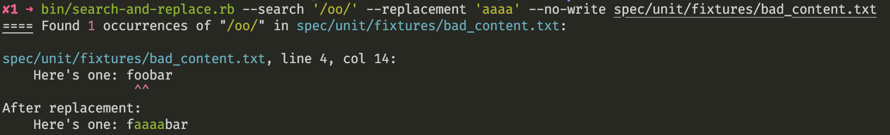

# pre-commit-search-and-replace

This is a plugin for [pre-commit](https://pre-commit.com) that will run search and replace string operations against files to be committed. Note that this plugin operates on each line of a file therefore multiple line patterns are not supported.

### Usage

By default, a YAML config file is loaded at `.pre-commit-search-and-replace.yaml` in the root of the repo. This config file should be a list of entries specifying any of the following keys:

- `search`: (required) the string or regexp to search for. To use a regexp, start and end with slashes. e.g. `/^mypattern/`
- `replacement`: the string to replace matched strings with. If specified, files will "fixed". Match groups can be referenced here (e.g. `\1` or `\k<foo>`)
- `insensitive`: boolean whether the regexp should be case-insensitive. default: `false`
- `extended`: boolean whether the regexp should be extended. default: `false`
- `description`: short text description of purpose of the entry.

The config file name can be changed by passing a `--config PATH` argument to the hook in the pre-commit config. A single search and replacement can be specified with `--search STRING` and `--replacement STRING` arguments as well instead of using a config file.

Other command line args:
- `--[no-]write` - Whether to write replacements to the file.
- `--[no-]color` - Whether to have output be colorized.

Example pre-commit config:

    - repo: https://github.com/mattlqx/pre-commit-search-and-replace
      rev: v1.1.3
      hooks:
      - id: search-and-replace

Example search-and-replace config:

    - search: /Something [bB]ad/
      replacement: Something Good
    - search: foobar
      insensitive: true
      replacement: FOOBAR
    - search: JustFailIfThisStringIsFound

Output can look something like this:



Specific lines in the committed files may be exempt from consideration by commenting as appropriate to the end of the line:

```
# no-search-replace

// no-search-replace
```

Or these comment styles that support being anywhere in the line:

```
/* no-search-replace */

<!-- no-search-replace -->
```